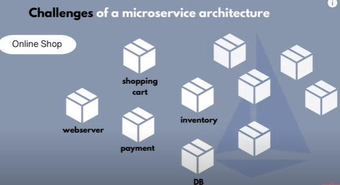
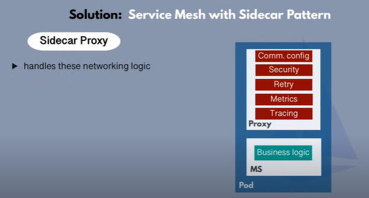

- istio is a service mesh
- service mesh manages communication between microservices 

- challeneges of microservice arch

- so we have different svcs in our app:

- now deploy these svcs in kub cluster (diff ms in diff pods)

- so now what does it need to run the application :
- so each ms has its owns BL like payment MS works on payment logic
- but ms have to communicate with each other 
- any eg
- so how to make them communicate

- so in order to communicate we need the end-point for a particular ms in the ms that wants to talk to that ms 
- so for eg a shopping cart ms want to talk to db ms so a shopping cart ms must have the end point of db ms and for this we need to do code changes 

- then we have security so with in akub cluster we have the firewall which protects the cluster moreover we can add a proxy layer outside the cluster so in this way it will first communicate with proxy intercept the req and from there it will allow to access to the cluster

- but still heres an issue the ms with in cluster can talk to each other and some attacker can do bad things

- so we need an extra layer of protection inside the cluster with in different microservices and instead of securing microservices or doing code in the ms we need to  protect those pod-pod communication 

- retry logic to make application more robust like retry the conn if some ms is throwing a problem 

- monitoring each ms and identify bottlenecks in the application and collect tracing data instead of adding the logic to each ms its not suitable 

- and dev dont work on actual service/app logic like configuring the netwrok for each ms and also adding extra things to ms making the code more complex

### SOLUTION IS SERVICE MESH:

- so we'll extract all these logics from ms (except for BL) and keep them seperate in a side car proxy

- sidecar proxy handles these network logic it act as a proxy and cluster operators can configure it easily with a simple api without worrying for the logic

- more over youdont add the config to ms yml file 

- as service mesh has control plane which will inject this proxy into all pods and now all the ms can talk with each other throught those proxies

- and netwrok layer for svc to svc comm is consist of control plan and the proxies is a service mesh

- TRAFFIC SPLITTING CONFIG - SVC MESH:

- so lets say a new payment system is made out 
- so you want 10% users to use the new systems so through service mesh you config the ms webserver to new payment system and rest to old version

- istio provides a way to impleme
- envoy proxy