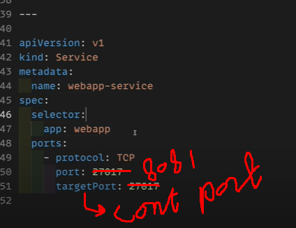

# A GUIDE TO DEPLOY MERN APP ON KUBERNETES

- so there's an issue you need to be careful about the `metadata` in the yaml field as this is exported as file-name so we have to make sure the file name and metadata is same

- we'll use two docker images: mongo (db) and mongo-express (web-app)
- we have control plane, worker nodes, configs (where we'll store mongoDB url so the web app can interact with it), secrets
- we'll have NodePort, this makes sure that only our app is accessible wiht in the network not the inernal or code of the app
- we'll also need to deployment of the app and for the deployment to be accessible in the network we have to make it available as a secret 
- now we need to write secret for that we have this: go from the docs pls keep the file name same as mongo-secret
- 
- so in mongo-url you'll provide what you have defined as service so the service will provide the url to this file i.e mongo-secret
- best practice is to keep diff secrets in diff file (for web it has we-sec.yaml and for db it'd be db.yaml) but for practice just lets keep it in a single point
- then create a ConfigMap (ConfigMap is a kind of config where you keep the non confidential data and by this you can make your service portable means that today your application is deployed on kubernetes and someother day you want to move it to MongoDB atlas or some other platform then you dont need to setup everything from scratch their you'll just used the defined ConfigMap)

- we'll upload the mongoURL after the deployment and marking mongo as service
- explore stateless and stateful components

# DEPLOYMENT:
- now we'll do the deployment for that we'd need a deployment yaml file based on nginix
- he discussed different components, should research about `label` 
-  | file name mongo-app.yaml
- change mongo-deployment and label should match everywhere app:mongo; image:mongo:6.0; port:27017
- Now we need to write the env variable being fetched from the secret file below is a sample for fetching the username"

- name should be the file name of secret; key should be the name what defined whatever you kept in secret file
- **WHY DO WE NEED SERVICE:** we need service so kubernetes can manage the assigned ip and dns assigned to each pod itself without service the dev had to need to do it  
- now for defining **SERVICE** just break the yaml file by ---
- we also need to define `selector` it tells that this service is for which deployment so from the same file you;ll see on above ln 9 a selector defined named as mongo
- then the target port is same as mongo 27017 your app container wrap around some pods ; keeping port same to avoid confusion
- and write this config: 
- update the mongo-url wherever needed
- so now our deployment file is completed for mongo db and whenever we want to do another deployment we just need to update the mongo image for that

**FOR WEB APP:**
- now copy the same deployement file i.e mongo-app.yml from above and use it as web app change the relevant files
- change name mongoapp-deployment to webapp-deployment and label to webapp; change the selector accordingly; change the label in template
- change the container info mongo-express and image with :latest
- we need to see port i.e 8081 from docker images
- now we need to provide env var for this too just view the docker image what envr var are needed 
- first we need server, and admin and psw
-
- so this is the info for the thirs key we refer it from the configMap file 
- now we need to define the service for it as well :

- now also define the `nodePort` as we need our app to access with in our local network and then for access from outside we can bind this port to any public dns or add (30200)
- also define the `type:NodePort` as default is cluster ip just below `spec:`
- nodePort as a range of 30000-31???

# CMD TERMINAL TIME
- now we'll do `minikube start` this will start the container it will pull the images from the web and everything is contaized
- using minikube you just point the cluster control plane tot he worker nodes and it interact with worker nodes and manage them 
- now we ahve minikube envr setup locally
- we'll use kubectl to interact witht hat envr
- `kubectl apply -f secret.yaml` -> -f is filename - do same for `mongo-config.yaml` `mongo-app.yaml` `web-app.yaml`
-  now lets see `kubectl get pod` and we'll see three pod `-o wide` -> this flag provide more detail
- `kubectl get secret` or `configMap`or `services`
- `minikube ip` -> this will tell whee minkube is running
- now also define what svc to expose `minikube service webapp-service`
- so there's an issue you need to be careful about the `metadata` in the yaml field as this is exported as file-name so we have to make sure the file name and metadata is same
- to redploy to delete everyting `kubectl delete deployment --all`and `service` and `secret` and `configmap` and then apply again