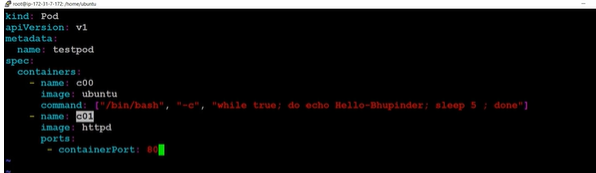
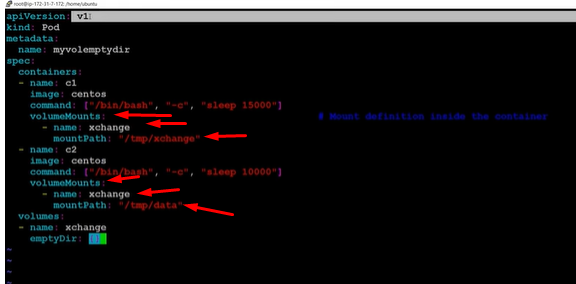
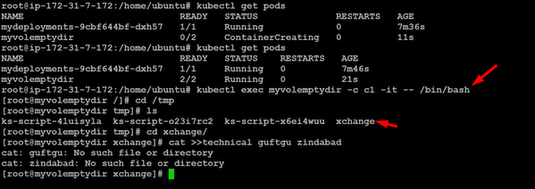
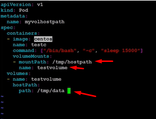
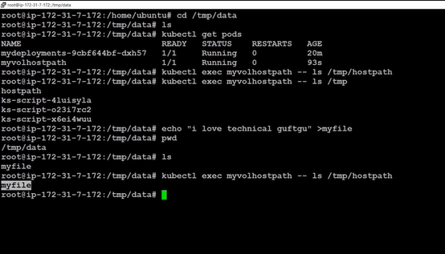

# NETWORKING

**cont to cont communication**

- containers within a pod use networking to communicate via loopback (as conts can talk to each other with in a same pod - have same ip)
- pod to pod communication within cluster is possible
- but if some external svc wants to comm with nodes then you need to expose your kub network as a service
- yml file demo: communicate 2 pods with each other
- create 2 containers

- httpd is apache server and it runs on port 80
- apply the yaml
- now go to c0 and communicate with c1 `kubectl exec testpod -it -c c00 -- /bin/bash`
- curl localhost:80 if this says it works means this is working
- here we can comm wrt local host as we are doing comm with in same pod  

**pod to pod communication**

- now pod (c0) to pod(c1) communication
- now for diff pods we need to communicate differently that is wrt ip add
- pop to pod communication on same worker node can only happen through pod's ip 

**services**
- you can see now to access pod you need ip and then the ref pod with it 
- and if a pod is recreated it will be created with a new ip add
- and now to access the pod you have to change the ip in terminal (curl req) to access it
- and we never know maybe the pod is now started in someother node so its very hard to keep track of pods
- so now you'll also make a service after deployment/replicaset/stateful
- what service does it : it applies the virtual ip and it maps the ip to the replica sets ip 

- service is a logical bridge which lets user communicate with pod (under the hood the ip changes but the bridge manages it by mapping the virtual ip to the pod)
- kube proxy is the one which keeps the rec for v.ip and the podsand it query the api server to learn about services in the cluster 

- services let you access the pods outside the cluster
- labels are used to select which are the pods to put under particular service 
- service provides you a endpoint to access it
- service type: clusterIP, nodePort, loadBalancer, Headless
- clusterip also uses vip and vip isn't accessible outside cluster 
- refer other notes for clusterip, nodeport 
- nodeport: node port (random port 30000-32***) > cluster ip > node ip
- using nodeport you can access the svc outside the cluster using the dns name of the machine

# VOLUMES:
- container volumes are olatile means once container restart the volume is lost assc with it 
- so we create volume outside pods in kubernetes and now it is volatile wrt to pod
**volume type**
- node-local type -> hostpath: you put the data in host - empty dir -> inside a pod which is shared among diff conts
- file sharing type - nfs
- secret, gitrepo

**Empty DIR**
- lets say we have a host/node inside our netwrok and the pod has 2 cont now i say i want a vol which i saccessible by both cont and the vol is inside the pod not outside if one of the cont is deleted and then recreated so still that cont can access the vol but if pod deletes then vol is also gone and after pod is recreated a new vol will be created and old data will be lost 
- major purpose is to share the volume among diff conts
- while creating cont .mount-volume is define in yaml
- create volume also

- same volume is def with both cont
- volume is defined at end
- now note that both cont has diff mount path (its the path for that cont ke kahan file banai)

- go to the path and you'll see volume file in the dir
- now create a file by doing cd in this volume
- now exit the cont and go to 2nd cont by doing the `exec` cmd
- and now if you do ls here and go to 'tmp' you'll see a data dir (as it was defined in the yml file)
- and now you'll note both cont has same file as of cont 1 

**HOST PATH**
- when one pod want to access another pod volume 
- so a middleware volume is built out side the nod and this will be accessible by both pods
- and then map it with host path so means it is (the vol) is assc with a host
-  
- this will create a vol in the hostPath location

- now we go into both pod and check if the file is available via both pods or not