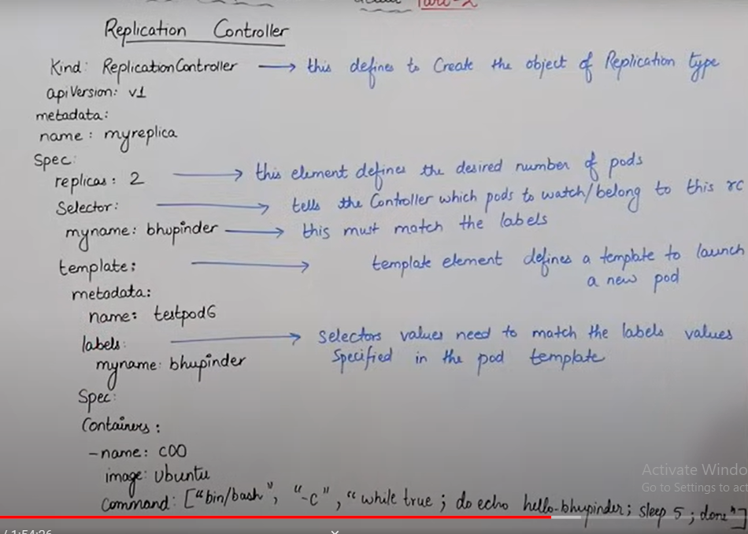
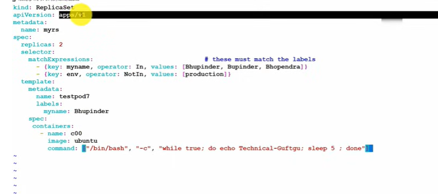
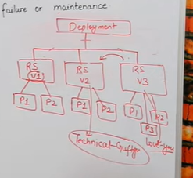
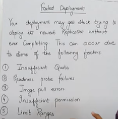

# KUBERNETES OBJECTS
- k8s use objects to represent the state of your cluster
- here you define the poilicies that how the application will behave such as restart policies, upgrades and fault tolerance
- this is also called as manifest
- **RELATIONSHIP BW OBJECTS**
    - pod manages container and replica set manages pods
- **STATE OF OBJ**
    - replicas(2/2), image,name, port, volume (map to the pod), detached(default)
    - declarative (can be reused for other deployments) and imperative way (cant be reused for other deployments)
    
- **K8S Configuration**
- all-in-one single node installation: master and worker node on both same instance - minikube - for testing/dev purpose only
- single node etcd, single master and multiple workers: 
- single node etcd, multiple master and multiple workers: provides high availability

# LABELS AND SELECTOR:
- identify which pod (any other object) for is what purpose. helps you to group hundreds of different object
- through selector you can select those pods and can access it
- `labels come under metdata field` 
- task: create * pod  with different labels
- `kubectl get pods ---show-labels`
- you can also apply label to a pod after they are created through imperative way `kubectl label pods <pod-name> key=value`
- `kubectl get oids -l key=value` or `key!=value` -> get all  pods with label of env having value developemnt or all thos except for env having value developemnt
- deleting pods: delete yaml file for that pod, delete pod directly, delete pod using label
- label dosent provide uniqueness means you can apply same label to 5 pods

**SELECTOR**: selectors are the one from which you can filter out the labels
- **TYPE OF LABELS:**
    - equality based => with = char in cmd (=,!=)
    - set based => (search label in/notin/exists key_1,key_2,key_3) `key in (value_1,value_2)`
    - `kubectl get pods -l 'key notin (v_1,v_2)'`
    -  `kubectl get pods -l key_1=v1, key_2=v_2 `
- **NODE SELECTOR:**
    - 1 master, 4 nodes - so now i want to say create 2 pod so master will create pod where ever resource is free/avl 
    - but if i define the node that i want the pods on certain node so i'll use nodeSelector  (first define label to the node; define in yaml: in spec for pod obj: nodeSelector -- hardware=aws-t2)
    - `kubectl apply -f pod.yml` `kubectl get pods` now you'll see against pod.yml that its (0/1) now to see why `kubectl describe pods <label-name>`
    - so you'll see that it couldn't find the node with label `hardware:t2-med`
    - `kubectl get nodes` and you'll see node info and the apply the label on node using `kubectl label nodes <node-name> <label>` here `label=hardware=tw-medium`
    - now check `kubectl get pods` and you'll find 1/1

- **SCALING AND REPLICATION**:
    
    - for scaling and replication we need to define certain things to achieve this
    - `replicas=2` -> means create 2 pods - so does it replicate with in same node - how the volume works in such scenarios? 
    - * Also with multiple pods you can achieve LOAD BALANCING among different instance (before 1 pod -> 350 pods) after replicas (1 inst - 200 pods , 2 inst - 150 pods)
    - `scaling` -> create pods according to use if theres too much traffic then scale up to 50 pods or whatever suits the traffic if there ain't much traffic then do scale down and just activate the nos of pod how many required
    
    - **REPLICATION CONTROLLER:**
        - it make sure that whatever define in replicas must be achieved
        - YAML FILE:
        - 
        - so you only define that what will be the pod is in same file no need to define the pod file explicitly 
        - so now run the `apply` cmd and see pod info in different context
        - now lets talk about **load balancing**
        - `kubectl scale --replicase=8 rc -l <label_key=label_val>`
        - now to remove rc you have to delete the file as upon deleting the pod it will recreate another pod
            
        - **REPLICA SET**
            - its a second version of rc - apiversion is changed
            - it supports both equality based and set based selectors
            - 
            - above is an example of RS.yml

- **DEPLOYMENTS:**
    - deployment is just like rs but here you get more control with the feature like such as intiate an update, **rollback and roll out** below is the picture which tells how deployment works 
    - so deployment has 3 rs and in each rs you have versioning consider as this update of your application
    - now you can see in v3 you ahve 3 pods so you updated your application and it created a new version for it
    - now what if you wanna roll back to v2 so for that you can do it via deployment but remeber that yes after roll back the cluster will be running the code for v2 but the no of pods will remain same? Q: so what will be happening in pod 3
    - any communication being done to pods is still being done via rs so depolyment first talk to rs and rs will talk to pods about any new configuration
    - deployment provides you with self healing so lets consider that if with rs1 you have define the desired stat of replicas as 2 but all of a sudden one of the pod goes down  so now the desired and current state mismatch this will alert the kuberentes and then self-healing will be apllied by the deployment object via intermediary rs which will create another copy of the pod and making the current working pods as 2 
    - **USE CASES:**
    - in any apps where you need backups and roll out and roll back features
    - so in rs if i make any changes in the yml and apply the file it will re create a new rs along with running the previous one
    - but in deployment it will close the first one rs and will start the 2nd new rs and if you wanna do roll back it will stop the 2nd rs and will resume the 1st rs that was stopped earlier
    - scale up and scale down - pods
    - you can pause and resume a deployment to fix bugs
    - clean up old rs 
    - `kubectl rollout undo deploy --to-revision=2` - go to prev version
    - `kubectl get deploy` -> you get this info from the cmd: 
        - READY - tells how many replicas are created
        - AVL - tells what rep are avl to user
        - few more - basic stuff
    - YAML FILE:
        - metadata - name : this will be same as rs name
        - `matchlabel - name` in replicas - spec should have same `label - name` as of pod
        - logs,rollout, get rs, describe deploy - **few cmds to learn**
    - FAILED DEPLOYMENT:
        - 
    - CMDS:
        - `deploy yml file` 
        - `kubectl get rs`
        - `kubectl get pods`
        - `kubectl delete pod <pod-info>`
        - `kubectl get rs`
        - `kubectl scale --replicas=1 deploy <deployment-label>` now it will chnage the replics and you can confirm by running `kubectl get rs`
        - `kubectl logs -f <pod-label>` it iwll tell you whats happening in pod
        - now change the deploy.ym
        - `apply deploy`
        - `kubectl get deploy` -> up tp date : 1 and avail: 2
        - `kube ctl get rs` -> this will now give you two rs and the older rs will be terminated and new one will be avl
        - now lets rollout `kube ctl rollout status deployment <label-name>`
        - so this will rollback to prev version
        - `kubectl rollout history deployment <label-name>` it will list down the no of changes
        - `kubectl rollout undo deploy/<label-name>` now it will roll back
        - `kubectl get deploy` you'll see the first deployment with no of pods from the cont before pod
        - to check the output go `kubectl logs -f <pod-label-name>` and you'll see the output from 1st deployment pod
